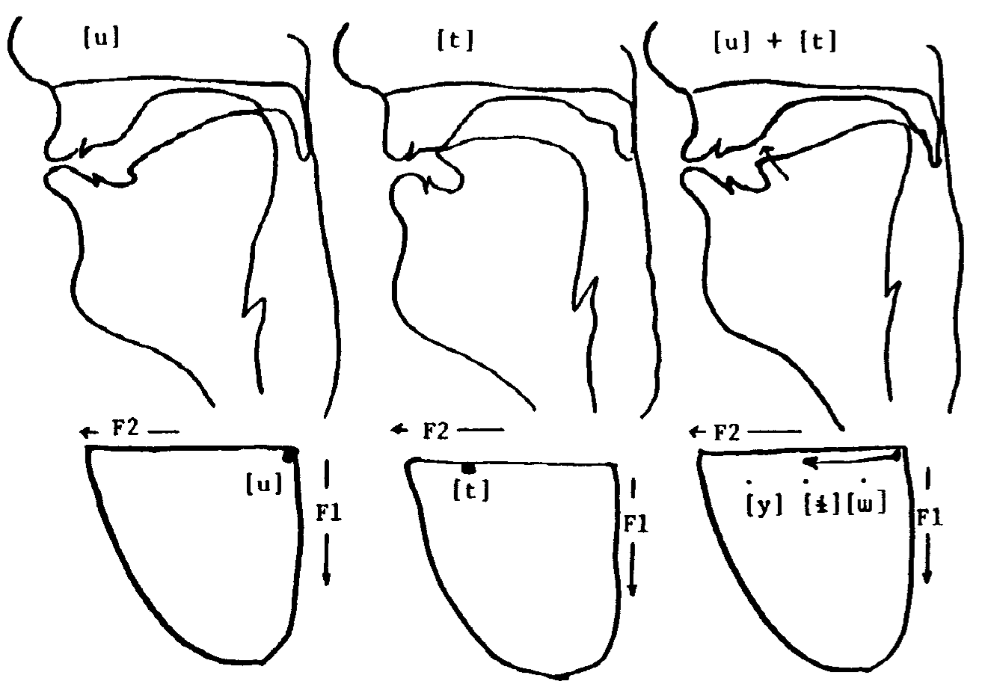

```{r setup, cache = F, include = F}
  library(knitr)
  opts_chunk$set(message = F,
        	 echo = F,
				 warning = F,
				 autodep = T,
         cache = T,
				 fig.align = "center")
  dep_auto()
```

```{r libraries, cache = F}
  library(phoneticChange)
  library(plyr)
  library(reshape2)
  library(dplyr)
  library(magrittr)
  library(ggplot2)
  library(grid)
  library(scales)
  library(RColorBrewer)

  # for kurtosis
  library(moments)

  # for gam smooths
  library(mgcv)
```

# Introduction


## This Talk

>- How does a change in pronunciation propogate across a speech community?
>- When a pronunciation changes over time, what aspect of speakers' knowledge of their language is changing?
>- What aspects of speakers' cognition constrain a pronunciation change like this in the first place?

## The Philadelphia Neighborhood Corpus

```{r fig.width = 8/1.5, fig.height = 5/1.5, out.width="90%"}
  localDemo <- phoneticChange::white%>%
                    mutate(DOB = year-age)
  
  minmax <- localDemo %>% filter(DOB == max(DOB)|DOB==min(DOB))
  ggplot(phoneticChange::white, aes(year, age, color = sex))+
    geom_point(position = position_jitter(width = 0.4))+
    geom_text(data = minmax, aes(label = DOB), color = "black")+
    theme_bw()
```


## The Philadelphia Neighborhood Corpus

- Despite having such a long time domain, the PNC doesn't *quite* directly observe the propogation of a pronunciation change across a speech community. We'll still try to make some reasonable inferences on the basis of the data that we do have.


## The Data

<div align="center" style="margin:5%;">

```{r results = 'asis'}
  phoneticChange::white %>%
    dplyr::summarise(`Speakers` = n(),
              `Transcribed (s)` = formatC(sum(transcribed), format = "d",
                                          big.mark = ","),
              `Vowels Measured` = formatC(sum(nvowels), format = "d",
                                          big.mark = ","))%>%
    kable(align = c("r","r","r"))

```

</div>

```{r, echo = T, eval=F}
library(shiny)
runApp(system.file("appdir/means", package="phoneticChange"))
```


# /ay/ Raising

## General pattern

```{r calculate_ay_means}
  ays_means <- ays %>%
                filter(context=="internal", stress == 1) %>%
                group_by(idstring, year, age, DOB, sex, years_of_schooling, 
                         plt_vclass, word) %>%
                dplyr::summarise(F1_n = mean(F1_n), tokens = n()) %>%
                dplyr::summarise(F1_n = mean(F1_n),
                          tokens = sum(tokens),
                          types = n())%>%
                mutate(ratio = tokens/types)
```

```{r maxi_midlow_means}
  all_midlow_means <- mid_low_means%>%
                          group_by(plt_vclass)%>%
                          summarise(F1_n = mean(F1_n))%>%
                          mutate(label = c(uh="ʌ", o="\u0251")[plt_vclass])
          

```

```{r minimal_brewer_pal}
  three_col <- brewer.pal(3, "Dark2")
```

```{r fig.width = 8/1.25, fig.height = 5/1.25, out.width="90%", dev = 'CairoPNG'}
  ays_means %>% 
  ggplot(., aes(DOB, F1_n,
                      color = plt_vclass)) +
    #geom_point()+
    stat_smooth(method = "gam", formula = y ~ s(x, bs = "cs"))+
    scale_y_reverse("Normalized F1")+
    geom_hline(data = all_midlow_means, aes(yintercept = F1_n), 
               linetype = 3, color = "grey10")+
    geom_text(data  = all_midlow_means, x= 1895, aes(y = F1_n-0.1, label = label),
               color = "grey10")+
    scale_color_brewer("Vowel Category", palette = "Dark2")+
    xlab("Date of Birth")+
    theme_bw()
```


## What does it Mean

### Population Shift?

```{r}
  t1_pop <- data.frame(DOB = 1890, F1_n = rep(1.35,50), pos = "low")
  t2_pop <- data.frame(DOB = 1920, F1_n = c(rep(1.35,45), rep(0.35,5)),
                       pos =  c(rep("low",45), rep("high",5)))
  t3_pop <- data.frame(DOB = 1950, F1_n = c(rep(1.35,5), rep(0.35,45)),
                       pos =  c(rep("low",5), rep("high",45)))
  t4_pop <- data.frame(DOB = 1980, F1_n = c(rep(1.35,0), rep(0.35,50)),
                       pos =  c(rep("low",0), rep("high",50)))


  t_pop <- rbind_all(list(t1_pop, t2_pop, t3_pop, t4_pop))

```


```{r population, fig.width = 8/1.25, fig.height = 5/1.25, out.width="90%"}
  ays_means %>% 
    filter(plt_vclass == "ay0")%>%
  ggplot(., aes(DOB, F1_n)) +
    geom_point(data = t_pop, aes(color = pos), position = position_jitter(width = 2, height = 0.1))+
    stat_smooth(method = "gam", formula = y ~ s(x, bs = "cs"))+
    scale_y_reverse("Normalized F1")+
    scale_color_brewer("Speakers", palette = "Dark2", limits = c("low", "high"))+
    xlab("Date of Birth")+
    theme_bw()
```

## What would it look like?
### Population Shift

>- Speakers are not internally variable. You are either a raising speaker, or a non-raising speaker.
>- The speech community is highly variable. 

## What does it mean?
### Lexicon

```{r fifty_random_words}

  set.seed(5)
  ays %>%
    filter(plt_vclass == "ay0")%>%
    group_by(word)%>%
    dplyr::summarise(n = n())%>%
    ungroup()%>%
    dplyr::mutate(rand = rnorm(n()))%>%
    arrange(rand)%>%
    head(50)%>%
    mutate(word = tolower(word))%>%
    select(word)-> rand_fifty
```

```{r t_lexicon}
  t1_lex <- rand_fifty%>%
              mutate(DOB = 1890, F1_n =  rep(1.35,50), pos = "low")
              
  t2_lex <- rand_fifty%>%
              mutate(DOB = 1920, 
                     F1_n = c(rep(1.35,45), rep(0.35,5)),
                     pos =  c(rep("low",45), rep("high",5)))

  t3_lex <- rand_fifty%>%
              mutate(DOB = 1950, 
                     F1_n = c(rep(1.35,5), rep(0.35,45)),
                     pos =  c(rep("low",5), rep("high",45)))

  t4_lex <- rand_fifty%>%
              mutate(DOB = 1980, 
                     F1_n = c(rep(1.35,0), rep(0.35,50)),
                     pos =  c(rep("low",0), rep("high",50)))

  t_lex <- rbind_all(list(t1_lex, t2_lex, t3_lex, t4_lex))
```

```{r lexicon, fig.width = 8/1.25, fig.height = 5/1.25, out.width="90%"}
  ays_means %>% 
    filter(plt_vclass == "ay0")%>%
  ggplot(., aes(DOB, F1_n)) +
    geom_text(data = t_lex, 
              aes(color = pos, label = word), 
              position = position_jitter(width = 2, height = 0.1),
              size= 3)+
    stat_smooth(method = "gam", formula = y ~ s(x, bs = "cs"))+
    scale_y_reverse("Normalized F1")+
    scale_color_brewer("Lexicon", palette = "Dark2", limits = c("low", "high"))+
    xlab("Date of Birth")+
    theme_bw()
```

## What would it look like?
### Lexicon

>- Speakers are internally variable. Sometimes they'll say a raising word, and other times they'll say a non-raising word.
>- The speech communuty isn't very variable. Speakers should be more or less similar to eachother.

## What does it mean?
### Variable Rule

>- /ay/ = [+low]
>- with probability $p$, ay $\rightarrow$ [-low]/__[-voice]
    - beginning of the change, $p=0$
    - middle of the change, $p=0.5$
    - end of the change, $p=1$
    
    
## What does it mean?
### Variable Rule

```{r t_phon}
  t1_phon <- data.frame(DOB = 1890, F1_n = rep(1.35,50), pos = "[+low]")
  t2_phon <- data.frame(DOB = 1920, 
                        F1_n = c(rep(1.35,45), rep(0.35,5)),
                        pos =  c(rep("[+low]",45), rep("[-low]",5)))
  t3_phon <- data.frame(DOB = 1950, F1_n = c(rep(1.35,5), rep(0.35,45)),
                       pos =  c(rep("[+low]",5), rep("[-low]",45)))
  t4_phon <- data.frame(DOB = 1980, F1_n = c(rep(1.35,0), rep(0.35,50)),
                       pos =  c(rep("[+low]",0), rep("[-low]",50)))


  t_phon <- rbind_all(list(t1_phon, t2_phon, t3_phon, t4_phon))
```


```{r phon_var, fig.width = 8/1.25, fig.height = 5/1.25, out.width="90%"}
  ays_means %>% 
    filter(plt_vclass == "ay0")%>%
  ggplot(., aes(DOB, F1_n)) +
    geom_text(data = t_phon, 
              aes(color = pos, label = pos), 
              position = position_jitter(width = 2, height = 0.1),
              size= 3)+
    stat_smooth(method = "gam", formula = y ~ s(x, bs = "cs"))+
    scale_y_reverse("Normalized F1")+
    scale_color_brewer("Feature", palette = "Dark2", limits = c("[+low]", "[-low]"))+
    xlab("Date of Birth")+
    theme_bw()
```

## What would it look like?
### Variable Rule

>- Speakers would be internally variable, alternatively raising and not raising /ay/ with some internally consistant probability.
>- The speech communuty wouldn't be very variable. There would be some characteristic probability of raising for birth cohorts & social strata.

## What does it mean?
### Continuous Change

```{r setup_gam}
  ays_means %>% filter(plt_vclass == "ay0")%>%
    gam(F1_n ~ s(DOB, bs = "cs"), data = .)->gam_mod


  pred <- data.frame(DOB = rep(seq(1890, 1998, length = 10), 50))
  pred$F1_n <- predict(gam_mod, newdata = pred)

```

```{r continuous, fig.width = 8/1.25, fig.height = 5/1.25, out.width="90%"}
  ays_means %>% 
    filter(plt_vclass == "ay0")%>%
  ggplot(., aes(DOB, F1_n)) +
    geom_point(data = pred, 
              aes(color = F1_n), 
              position = position_jitter(width = 2, height = 0.1))+
    stat_smooth(method = "gam", formula = y ~ s(x, bs = "cs"))+
    scale_y_reverse("Normalized F1")+
    scale_color_gradient("Phonetic Target", high = three_col[1], low = three_col[2])+
    xlab("Date of Birth")+
    theme_bw()
```


## What would it look like?
### Continuous Change

>- Speakers wouldn't be very variable aside from the intrinsic variation involved in trying to hit a real-valued target.
>- The speech community wouldn't very variable. There would be some characteristic pronunciation target for birth cohorts & social strata.

## Totally No Stawmen Here

>- There are at least a handfull of examples of language change that *did* progress like each of the models described here.
>- But some theories of phonology, phonetics, and sound change do rule out the possibility of the final, continuous change model.
>- The first three models seem to be the ones most commonly assumed by new entrants to the field.
>- There is often covert variation between practitioners as to which model they're assuming!

# What it does look like.

## Trend with speaker means

```{r trend_with_means, fig.width = 8/1.25, fig.height=5/1.25, out.width="90%"}
  ays_means %>% 
  ggplot(., aes(DOB, F1_n, color = plt_vclass)) +
    geom_point()+
    stat_smooth(method = "gam", formula = y ~ s(x, bs = "cs"))+
    scale_y_reverse("Normalized F1")+
    scale_color_brewer("Vowel Class", palette = "Dark2")+
    xlab("Date of Birth")+
    theme_bw()
```

## Cohen's D

```{r}
  ays %>%
    filter(context == "internal")%>%
    group_by(idstring, DOB, plt_vclass)%>%
    dplyr::summarise(mean = mean(F1_n), var = var(F1_n), n = n())%>%
    filter(n()==2)%>%
    arrange(plt_vclass)%>%
    summarise(s = sqrt(sum((n-1)*var)/(sum(n)-2)),
              diff = diff(mean))%>%
    mutate(d = diff/s)->ay_cohen

```

```{r cohen_plot, fig.width = 8/1.25, fig.height=5/1.25, out.width="90%"}
  ggplot(ay_cohen, aes(DOB, d))+
    geom_hline(y = 0)+
    geom_point()+
    stat_smooth(method = gam, formula = y ~ s(x, bs = "cs"))+
    scale_y_reverse("Cohen's d")+
    xlab("Date of Birth")+
    theme_bw()

```


## What it means

>- We can rule out the population shift model. 
>- The lexicon shift model, and the variable rule models can't be ruled out yet.
    - If speakers were sampling from two distributions, or two lexicons, their *means* would still shift continuously.
    
## Distributional Properties

- Both the kurtosis and the standard deviation of a mixture distribution *should* systematically co-vary with the mean.
```{r, echo = T, eval=F}

library(shiny)
runApp(system.file("appdir/mixdists", package="phoneticChange"))
```


## Distributional Properties

```{r}
  ays %>%
    filter(context == "internal")%>%
    group_by(idstring, plt_vclass, DOB)%>%
    filter(n()>20)%>%
    summarise(F1_mean = mean(F1_n),
              F1_sd = sd(F1_n),
              F1_kurtosis = kurtosis(F1_n))->ays_dist_info
```

```{r fig.width = 8/1.25, fig.height = 5/1.25, out.width = "90%"}
  ays_dist_info %>% filter(plt_vclass == "ay0")%>%
  ggplot(., aes(F1_mean, F1_sd))+
    geom_point(color = three_col[2])+
    stat_smooth(method = gam, formula = y ~ s(x, bs = "cs"),color = three_col[2])+
    scale_y_continuous("F1 Standard Deviation", trans = "log2")+
    scale_x_reverse("Mean F1")+
    theme_bw()
```


## Distributional Properties


```{r fig.width = 8/1.25, fig.height = 5/1.25, out.width = "90%"}
  ays_dist_info %>% filter(plt_vclass == "ay0")%>%
  ggplot(., aes(F1_mean, F1_kurtosis))+
    geom_hline(y = 3, linetype = 2)+
    geom_point(color = three_col[2])+
    stat_smooth(method = gam, formula = y ~ s(x, bs = "cs"),color = three_col[2])+
    scale_y_continuous("F1 kurtosis", trans = "log2")+
    scale_x_reverse("F1 mean")+
    theme_bw()
```

## Distributional Properties
### Simulation
```{r}
low_speakers <- ays_means%>%
  filter(plt_vclass=="ay0",
         tokens > 10,
         ratio < 10)%>%
  ungroup()%>%
  arrange(F1_n)%>%
  tail()

high_speakers <- ays_means%>%
  filter(plt_vclass=="ay0",
         tokens > 10,
         ratio < 10)%>%
  ungroup()%>%
  arrange(F1_n)%>%
  head()


low_data <- ays %>%
  filter(idstring %in% low_speakers$idstring,
         plt_vclass == "ay0")%>%
  mutate(dist = "low")%>%
  group_by(idstring)%>%
  mutate(id = 1:n())%>%
  filter(id <= 60)


high_data <- ays %>%
  filter(idstring %in% high_speakers$idstring,
         plt_vclass == "ay0")%>%
  mutate(dist = "high")%>%
  group_by(idstring)%>%
  mutate(id = 1:n())%>%
  filter(id <= 60)

```


```{r fig.width = 8/1.25, fig.height = 5/1.25, out.width = "90%"}
  hi_low_data <- rbind_list(low_data, high_data)
  hi_low_data%>%
    mutate(idstring = reorder(as.factor(idstring), F1_n, mean))->hi_low_data

  ggplot(hi_low_data, aes(as.factor(as.numeric(idstring)), F1_n)) + 
    geom_point(position = position_jitter(width = 0.1, height = 0))+
    facet_wrap(~dist, scales = "free_x")+
    scale_y_reverse("Normalized F1")+
    xlab("speaker")+
    theme_bw()
```

## Distributional Properties
### Simulation

```{r}
  #' For the code to run the simulation, see system.file("run_sim/run_sim.R", package = "phoneticChange")

simulation %>% 
  melt(., id = 1:3, variable.name = "param")%>%
  group_by(p, param)%>%
  dplyr::summarise(lo = quantile(value, 0.025),
            mid = median(value),
            hi = quantile(value, 0.975))%>%
  melt(., id = 1:2)%>%
  dcast(., p ~ param+variable)->sim_summary
```

```{r fig.width = 8/1.25, fig.height = 5/1.25, out.width = "90%"}
  ays_dist_info%>%filter(plt_vclass == "ay0")%>%
  ggplot(., aes(F1_mean, F1_sd))+
    geom_ribbon(data = sim_summary, aes(x = F1_mean_mid, 
                                        y = F1_sd_mid, 
                                        ymin = F1_sd_lo, 
                                        ymax = F1_sd_hi),
                alpha = 0.6)+
    geom_point(color = three_col[2])+
    stat_smooth(method = gam, formula = y~s(x, bs ="cs"),color = three_col[2])+
    scale_y_continuous("F1 standard deviation", trans = "log2")+
    scale_x_reverse("Mean F1")+
    theme_bw()
```

## Distributional Properties
### Simulation

```{r fig.width = 8/1.25, fig.height = 5/1.25, out.width = "90%"}
  ays_dist_info%>%filter(plt_vclass == "ay0")%>%
  ggplot(., aes(F1_mean, F1_kurtosis))+
    geom_hline(y = 3, linetype = 3)+
    geom_ribbon(data = sim_summary, aes(x = F1_mean_mid, 
                                        y = F1_kurtosis_mid, 
                                        ymin = F1_kurtosis_lo, 
                                        ymax = F1_kurtosis_hi),
                alpha = 0.6)+
    geom_point(color = three_col[2])+
    stat_smooth(method = gam, formula = y~s(x, bs ="cs"),color = three_col[2])+
    scale_y_continuous("F1 kurtosis", trans = "log2")+
    scale_x_reverse("Mean F1")+
    theme_bw()
```

## Distributional Properties
### Simulation

```{r fig.width = 8/1.25, fig.height = 5/1.25, out.width = "90%"}
  ggplot(simulation, aes(F1_sd, F1_kurtosis)) +
    stat_density2d(contour = F, geom = "tile", aes(fill = ..density..))+
    geom_hline(y = 3, linetype = 2)+
    geom_point(data = ays_dist_info%>%filter(plt_vclass == "ay0"), color = three_col[2])+
    scale_y_continuous("F1 kurtosis", trans = "log2")+
    scale_x_continuous("F1 standard deviation", trans = "log2")+
    scale_fill_gradient(low = "white",high = "black")+
    theme_bw()
```


## Distributional Properties
### Comparsion to non-change
```{r fig.width = 8/1.25, fig.height = 5/1.25, out.width = "90%"}
  ggplot(ays_dist_info, aes(DOB, F1_sd, color = plt_vclass))+
    geom_point()+
    stat_smooth(method = gam, formula = y ~ s(x, bs = "cs"))+
    scale_color_brewer("Vowel Class", palette = "Dark2")+
    scale_y_continuous("F1 standard deviation", trans = "log2")+
    xlab("Date of Birth")+
    theme_bw()
```


## Distributional Properties
### Comparsion to non-change

```{r fig.width = 8/1.25, fig.height = 5/1.25, out.width = "90%"}
  ggplot(ays_dist_info, aes(DOB, F1_kurtosis, color = plt_vclass))+
    geom_hline(y = 3, linetype = 2)+
    geom_point()+
    stat_smooth(method = gam, formula = y ~ s(x, bs = "cs"))+
    scale_color_brewer("Vowel Class", palette = "Dark2")+
    scale_y_continuous("F1 kurtosis", trans = "log2")+
    xlab("Date of Birth")+
    theme_bw()
```


<!-- 

## Distributional Properties
### Comparsion to non-change

```{r fig.width = 5/1.25, fig.height = 5/1.25, out.width="50%"}
  ays_dist_info %>%
    dcast(idstring + DOB ~ plt_vclass, value.var = "F1_sd")%>%
    ggplot(., aes(ay, ay0))+
      geom_abline(linetype = 2)+
      geom_point()+
      stat_smooth(method = gam, formula = y ~ s(x, bs = "cs"))+
      scale_y_continuous(trans = "log2")+
      scale_x_continuous(trans = "log2")+
      coord_fixed()+
      ggtitle("standard deviation")+
      theme_bw()
  
```

## Distributional Properties
### Comparsion to non-change

```{r fig.width = 5/1.25, fig.height = 5/1.25, out.width="50%"}
  ays_dist_info %>%
    dcast(idstring + DOB ~ plt_vclass, value.var = "F1_kurtosis")%>%
    ggplot(., aes(ay, ay0))+
      geom_abline(linetype = 2)+
      geom_hline(y = 3, linetype = 3)+
      geom_vline(x = 3, linetype = 3)+
      geom_point()+
      scale_y_continuous(trans = "log2")+
      scale_x_continuous(trans = "log2")+
      coord_fixed()+
      ggtitle("kurtosis")+
      theme_bw()
  
```

-->

## Distributional Properties

>- It doesn't look like any of the categorical mixing models characterize the data well.
    - Looking just at the distributional properties of pre-voiceless /ay/, it doesn't look like speakers are every sampling from two different distributions.
    - Comparing pre-voiceless /ay/ to the rest of /ay/, its distributional properties aren't different, or at least not in the way expected.
    
>- The continuous shift model looks like it best characterizes the data.


# Individuals or Communities?

## Where is this change?
 
>- Is this change being mostly driven by individual speakers changing how they speak?
>- Or is it being driven by inter-generational shift?

#### Problem

>- The PNC has no longitudinal data for individual speakers.

## Where is this change?
### Problem

```{r fig.width = 8/1.25, fig.height = 5/1.25, out.width = "90%"}
  ggplot(white, aes(year-age, age))+
    geom_point()+
    xlab("Date of Birth")+
    theme_bw()+
    coord_fixed()
```

## Where is this change?


```{r echo = T}
  ays_means %>% 
    filter(plt_vclass == "ay0") %>%
    gam(F1_n ~ ti(age) + ti(DOB) + ti(age, DOB), data = .) -> model
```

## Where is this change?

```{r}
  ay_gam_grid <- expand.grid(age = seq(20,80, by = 10),
                             year = seq(1973,2013, by = 10))%>%mutate(DOB = year-age)

  ay_gam_grid <- ay_gam_grid%>%
                    mutate(pred = as.numeric(predict(model, newdata = ay_gam_grid)),
                           se = as.numeric(predict(model, 
                                                   newdata = ay_gam_grid, se = T)$se))
  ay_gam_first <- ay_gam_grid %>% filter(DOB > 1894, DOB < 1992)%>%
                          group_by(DOB) %>%
                          summarise(age = min(age),
                                    pred = pred[1])%>%
                          mutate(point = "last")
  ay_gam_firstpoint <- ay_gam_first
```

```{r fig.width = 8/1.25, fig.height = 5/1.25, out.width = "90%"}
  ay_gam_grid %>%
  ggplot(., aes(age, pred, color = DOB))+
    geom_ribbon(aes(group = DOB, 
                    ymin = pred - (1.96 * se), 
                    ymax = pred + (1.96 * se)),alpha = 0.3, color = NA)+
    geom_line(aes(group = as.factor(DOB)), size = 1) +
    geom_text(data = ay_gam_firstpoint, aes(x = age-3, label = DOB), size = 3.5)+
    scale_y_reverse("Normalized F1")+
    theme_bw()
```

## Where is this change?

```{r}
  ay_first_dob <- ay_gam_grid %>%
                          filter(DOB > 1894, DOB < 1992)%>%
                          group_by(DOB) %>%
                          summarise(pred = pred[1])

```

```{r fig.width = 8/1.25, fig.height = 5/1.25, out.width = "90%"}
  ay_gam_grid %>%
  ggplot(., aes(year, pred, color = DOB))+
    geom_ribbon(aes(group = DOB, 
                    ymin = pred - (1.96 * se), 
                    ymax = pred + (1.96 * se)),alpha = 0.3, color = NA)+
    geom_line(aes(group = as.factor(DOB)), size = 1) +
    geom_text(data = ay_first_dob, aes(x = 1970, label = DOB), size = 3.5)+
    scale_y_reverse("Normalized F1")+
    theme_bw()
```

## Where is this change?

```{r}
  ay_first_age <- ay_gam_grid %>%
                          group_by(age) %>%
                          summarise(pred = pred[1])

```

```{r fig.width = 8/1.25, fig.height = 5/1.25, out.width = "90%"}
  ay_gam_grid %>%
  ggplot(., aes(year, pred, color = age))+
    geom_ribbon(aes(group = age, 
                    ymin = pred - (1.96 * se), 
                    ymax = pred + (1.96 * se)),alpha = 0.3, color = NA)+
    geom_line(aes(group = as.factor(age)), size = 1) +
    geom_text(data = ay_first_age, aes(x = 1970, label = age), size = 3.5)+
    scale_y_reverse("Normalized F1")+
    theme_bw()
```


## Where is this change?

>- The estimated age trends within birth cohorts seem relatively flat.
>- The change seems to mostly play out between generational cohorts.


# Why?

## Non-random errors in the signal

<div style="width:70%">



</div>
Ohala (1981)


## Non-random errors in the signal

#### Pre-voiceless Shortening

- Before voiceless consonants, vowels are shorter.
- With less time to make such a big gesture for /ay/, speakers cut corners and pronounce the first part higher.

#### Offglide Peripheralizatiom

- Before voiceless consonants, the [i] part of /ay/ is pronounced even higher and fronter than usual.


## Non-random errors in the signal
### A natural experiment

The difference between /t/ and /d/ is largely neutralized in certain contexts.

<div style = "width:80%;margin-left:20%;float:left">
<div style = "float:left;margin:5px">

| | /t/ | /d/ |
|:-- |:--  | :-- |
| *faithful* |write| ride|
| *flapping* |writer| rider|

</div>
<div style = "float:left;margin:5px">

| /t/ | /d/ |
|:--  | :-- |
|r&#652;it| raid|
|r&#652;i**&#638;**&#602;| rai**&#638;**&#602;|

</div>
</div>

## Flapping Neutralization


```{r}
  ays_faith <- ays_faith %>%
                  mutate(F1_80_n = as.numeric(as.character(F1_80_n)),
                         context = "faithful")

  ays_flap <- ays_flap %>%
                  mutate(F1_80_n = as.numeric(as.character(F1_80_n)),
                         context = "flap")%>%
                  filter(flap_coding %in% c("app", "approx", "flao", "flap","?"))

  ays_comp <- rbind.fill(ays_faith, ays_flap)
```

```{r fig.width = 8/1.25, fig.height = 5/1.25, out.width = "90%"}
  ays_comp %>%
    group_by(DOB, context, fol_seg, idstring, word)%>%
    summarise(dur = exp(mean(log(dur))))%>%
    summarise(dur = exp(mean(log(dur))))%>%
    ggplot(., aes(DOB, dur*1000, color = fol_seg, linetype = context))+
      #geom_point()+
      stat_smooth(method = gam, formula = y ~ s(x, bs = "cs"))+
      scale_color_brewer(palette = "Dark2")+
      scale_y_continuous("Duration (ms)",trans = "log10", breaks = c(50, 100, 150, 200, 250))+
      xlab("Date of Birth")+
      theme_bw()
```


## Flapping Neutralization


```{r fig.width = 8/1.25, fig.height = 5/1.25, out.width = "90%"}

  track_flap1 <- flap_tracks%>%filter(context == "flap")
  track_flap2 <- flap_tracks%>%filter(context == "faithful", fol_sp)

  track_flap <- rbind.fill(track_flap1, track_flap2)

  glides <- track_flap %>%
                filter(percent > 0.75, percent < 0.85)%>%
                mutate(part = "glide")
  f1_max <- track_flap %>%
              group_by(id, idstring)%>%
              filter(F1_n == max(F1_n))%>%
              mutate(part = "nucleus")


  f1_max %>%
    rbind_list(glides)%>%
    mutate(DOB = year-age)%>%
    dcast(., id + idstring + DOB + word + fol_seg + context ~ part, value.var = "F1_n")%>%
    group_by(DOB, fol_seg, context, idstring, word)%>%
    summarise(glide = mean(glide),nucleus = mean(nucleus), ntg = mean(nucleus-glide))%>%
    summarise(glide = mean(glide),nucleus = mean(nucleus), ntg = mean(nucleus-glide))->track_means

    track_means %>%
    ggplot(., aes(DOB, glide, color = fol_seg, linetype = context))+
      stat_smooth(method = gam, formula = y ~ s(x), size=  1)+
      scale_color_brewer(palette = "Dark2")+
      scale_y_reverse("Glide Height")+
      xlab("Date of Birth")+  
      theme_bw()

```


## Flapping Neutralization

```{r fig.width = 8/1.25, fig.height = 5/1.25, out.width = "90%"}

    track_means %>%
    ggplot(., aes(DOB, ntg, color = fol_seg, linetype = context))+
      stat_smooth(method = gam, formula = y ~ s(x), size=  1)+
      scale_color_brewer(palette = "Dark2")+
      ylab("Nucleus-Glide difference")+
      xlab("Date of Birth")+
      theme_bw()
```

## Flapping Neutralization

>- The non-random errors in the noise seem to be distributed differently between pre-faithful and pre-flapped contexts:
    - Duration: faithful and flapped /t/ > flapped /d/ > faithful /d/
    - Peripheralization: faithful /t/ > flapped /t/ and faithful and flapped /d/
    
## The Change

```{r fig.width = 8/1.25, fig.height = 5/1.25, out.width = "90%"}
  ays_comp %>%
    group_by(DOB, context, fol_seg, idstring, word)%>%
    summarise(F1_n = mean(F1_n))%>%
    summarise(F1_n = mean(F1_n))%>%
    ggplot(., aes(DOB, F1_n, color = fol_seg, linetype = context))+
      #geom_point()+
      stat_smooth(method = gam, formula = y ~ s(x, bs = "cs"))+
      scale_color_brewer(palette = "Dark2")+
      scale_y_reverse("Normalized F1")+
      xlab("Date of Birth")+
      theme_bw()
```


## The Change

- The degree of participation in the change appears *not* to be circumscribed by other continuous parameters of speech, by other, top-down cognitive factors.


## Non-linear Bayesian Modelling

```{r fig.width = 8/1.25, fig.height = 5/1.25, out.width = "90%"}
  dob_deltas <- extract_from_summary(ar1_summary_df, "dob_deltas")%>%
                   mutate(context2 = c("D_faithful","D_flap", "T_faithful", "T_flap")[V1])

  dob_deltas <- cbind(dob_deltas, colsplit(dob_deltas$context2, 
                                         pattern = "_",
                                         names = c("fol_seg","context")))
  dob_deltas %>%
    ggplot(., aes(V2 + 1890, mean, linetype=context, color = fol_seg)) +
      geom_hline(y=0,color = "grey50")+
      geom_line(size = 0.7)+
      geom_ribbon(aes(ymax= `2.5%`, ymin = `97.5%`, fill = fol_seg), 
                  alpha = 0.3)+
      scale_y_reverse("year-over-year change")+
      xlab("Date of Birth")+
      scale_color_brewer("Following Segment", palette = "Dark2")+
      scale_fill_brewer("Following Segment", palette = "Dark2")+
      scale_linetype("Context")+  
      facet_grid(context~fol_seg)+
      theme_bw()
```


## Non-linear Bayesian Modelling

```{r fig.width = 103/1.25, fig.height = 5/1.25, out.width = "90%"}
  dob_mu <- extract_from_summary(ar1_summary_df, "dob_mu")
  dob_mu <- dob_mu %>%
                  mutate(context2 = c("D_faithful","D_flap", "T_faithful", "T_flap")[V1])
  dob_mu <- cbind(dob_mu, colsplit(dob_mu$context2, 
                                         pattern = "_",
                                         names = c("fol_seg","context")))
  dob_mu %>%
    ggplot(., aes(V2 + 1889, mean, linetype=context, color = fol_seg)) +
      geom_ribbon(aes(ymax= `2.5%`, ymin = `97.5%`, fill = fol_seg), 
                  alpha = 0.3)+
      geom_line(size = 0.7)+  
      scale_y_reverse("Estimated F1")+
      xlab("Date of Birth")+
      scale_color_brewer("Following Segment", palette = "Dark2")+
      scale_fill_brewer("Following Segment", palette = "Dark2")+
      scale_linetype("Context")+  
      facet_grid(.~context, labeller = label_both)+
      theme_bw()
```


## Non-linear Bayesian Modelling

```{r fig.width = 8/1.25, fig.height = 5/1.25, out.width = "90%"}
mu_diffs <- extract_from_summary(ar1_summary_df, "mu_diff")

t_d_diff <- mu_diffs %>% filter(V1 %in% c(1,2)) %>%
              mutate(context = c("faithful","flap")[V1])
  t_d_diff %>%
    ggplot(., aes(V2 + 1889, mean, color = context, linetype = context)) + 
      geom_hline(y = 0,color = "grey50")+
      geom_line(size = 0.7)+
      geom_ribbon(aes(ymax= `2.5%`, ymin = `97.5%`, fill = context), 
                  alpha = 0.3)+
      scale_y_reverse("Difference between following D and T")+
      xlab("Date of Birth")+  
      scale_color_brewer("Context", palette = "Set1")+
      scale_fill_brewer("Context", palette = "Set1")+  
      theme_bw()
```

## Other Things I've Looked At

>- ~~Word Frequency~~
>- ~~Ratio with which a stem appears in a flapping vs a faithful context~~

# Conclusions

## Conclusions

>- It is possible for continuous properites of speech to change.
    - These continuous properties must be part of speakers' knoweldge of their language.
>- These changes are not necessarilly circumscribed by other continuous properties of speech.
    - A top down, categorical aspect of speakers' knowledge of their language appears to have played a crucial role at the initiation of this sound change.
>- There is still a lot of work to be done in understanding how and why changes like this happen, if our reasonable assumptions about them don't seem to pan out.

